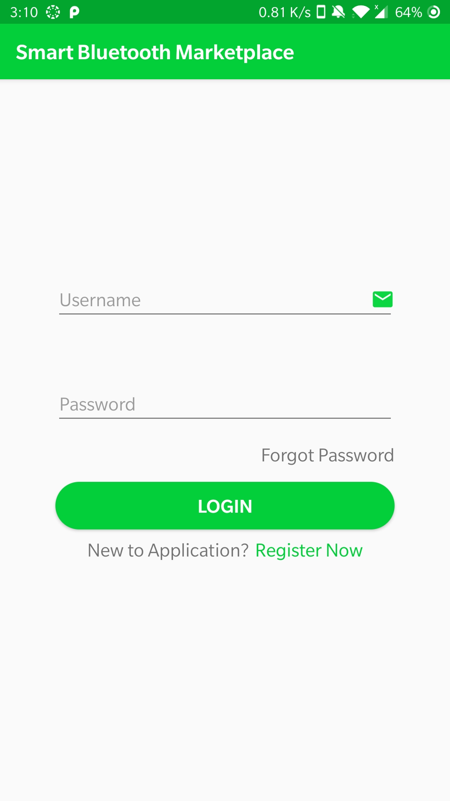
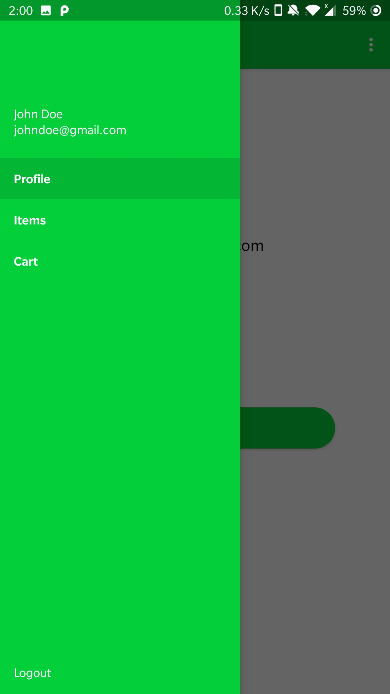
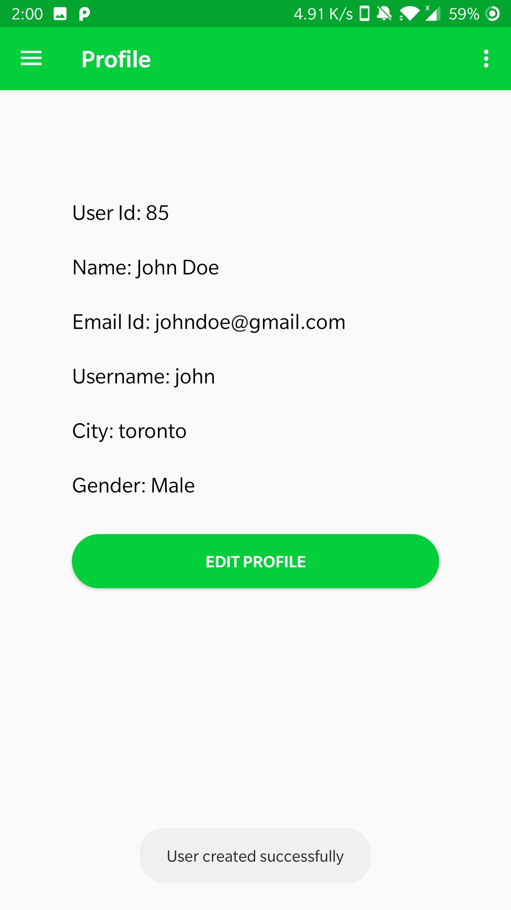
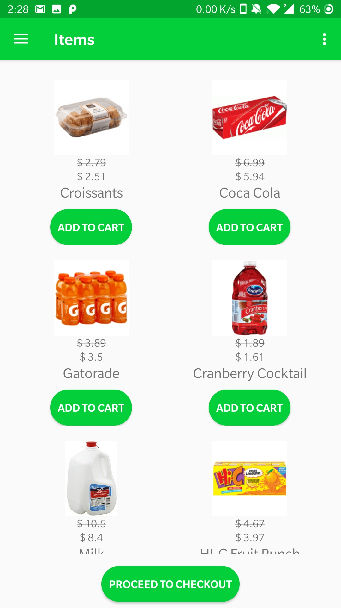
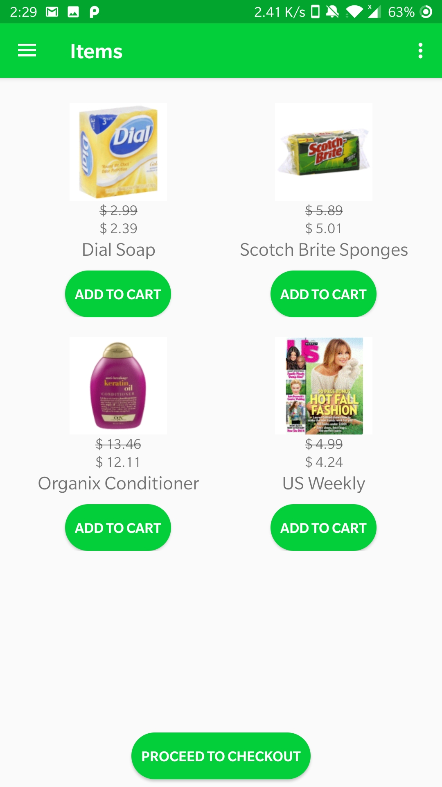
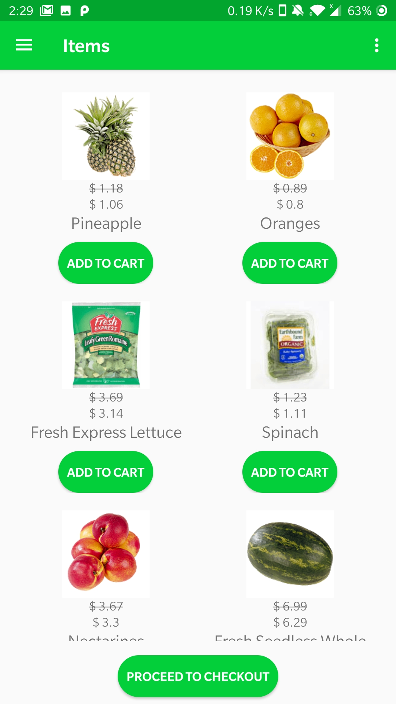
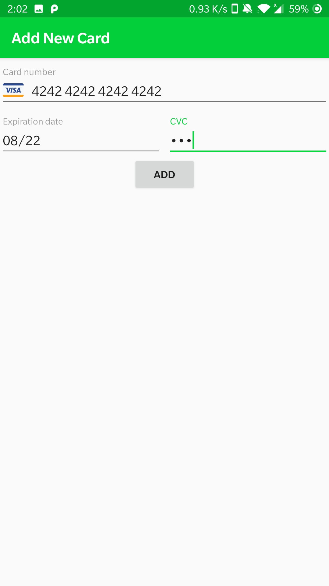
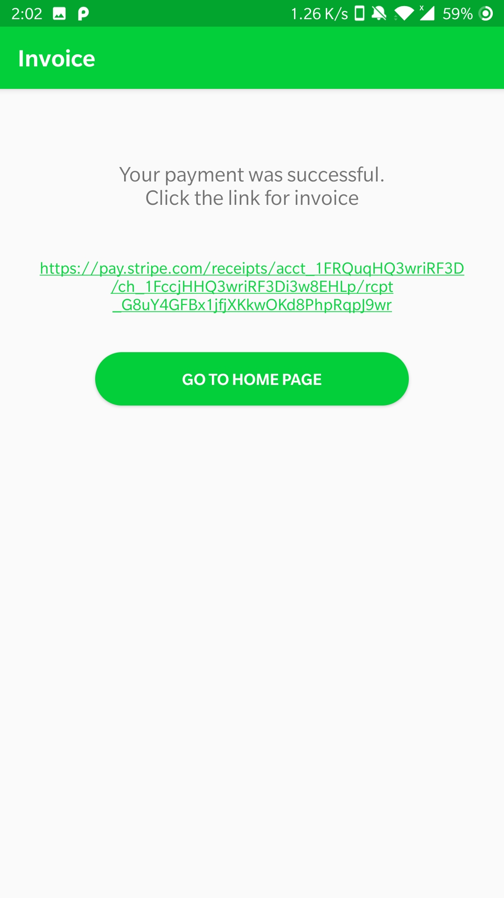
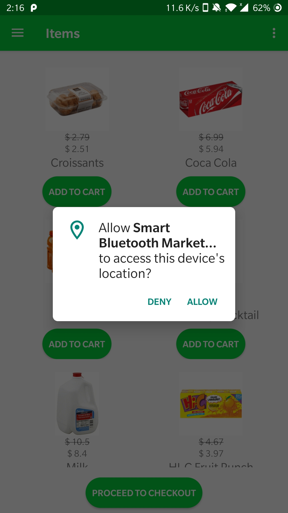
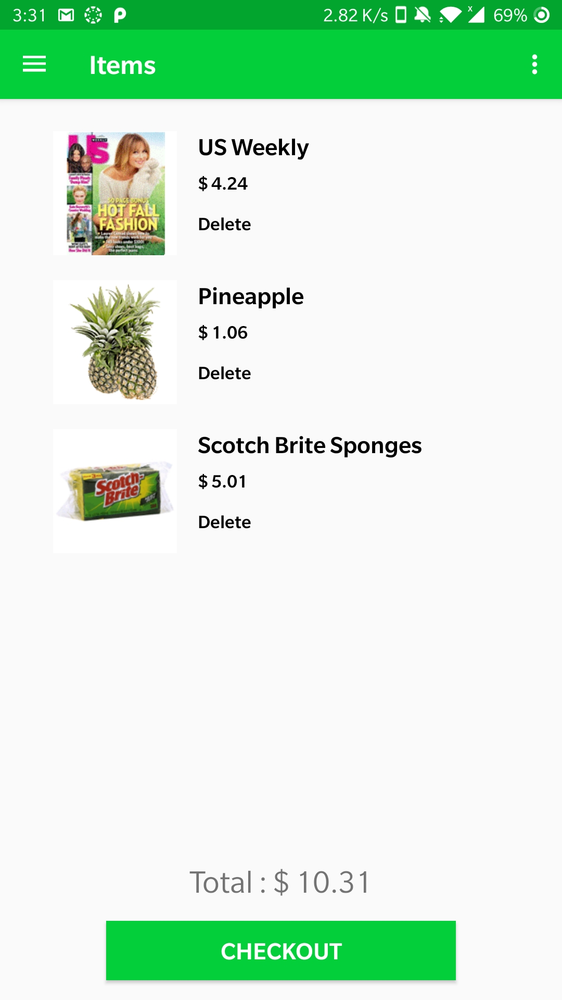

# Smart Bluetooth Market Place

This Application focuses on using bluetooth beacons to provide indoor proximity information in a grocery store environment. The app assumes a grocery store which has several aisles on which different products are placed. Bluetooth Beacons will places on each of the store’s aisles. The app provides the user a context aware customized list of discounted products for the aisle closest to the user.

## **Technologies:**
* Mobile Framework: Android
* Web app - Node.js
* Storage/Database: MongoDB
* API: Stripe Payment gateway, Estimote Bluetooth beacon sdk

## Screenshots

Login Screen             |Navigation Screen             |Profile Screen            |Beacon 1/Aisle 1             |
:-------------------------:|:-------------------------:|:-------------------------:|:-------------------------:
  |   |   |  

Beacon 2/Aisle 2             |Beacon 3/Aisle 3             |Add Card payment details            |
:-------------------------:|:-------------------------:|:-------------------------:
  |   |   

Invoice Url            |Permission            |Cart            |
:-------------------------:|:-------------------------:|:-------------------------:
 |   |   

## Getting Started

These instructions will get you a copy of the project up and running on your local machine for development and testing purposes.

### Prerequisites
* Android Studio [Download Android Studio](https://developer.android.com/studio)
* [Heroku](https://www.heroku.com/)
* Bluetooth Beacons 
* Stripe Payment Gateway
* Braintree

### API Routes
Application is hosted on a heroku app server.
Domain Link: [https://profile-application.herokuapp.com/](https://profile-application.herokuapp.com/)
All the routes takes header as:
Content-Type: application/json

### Installing
There are two folders to this project
1. ProfileApplication - It contains an android project.
2. webapp - Nodejs web application 

Clone the repo and open BLE folder inside android studio.
